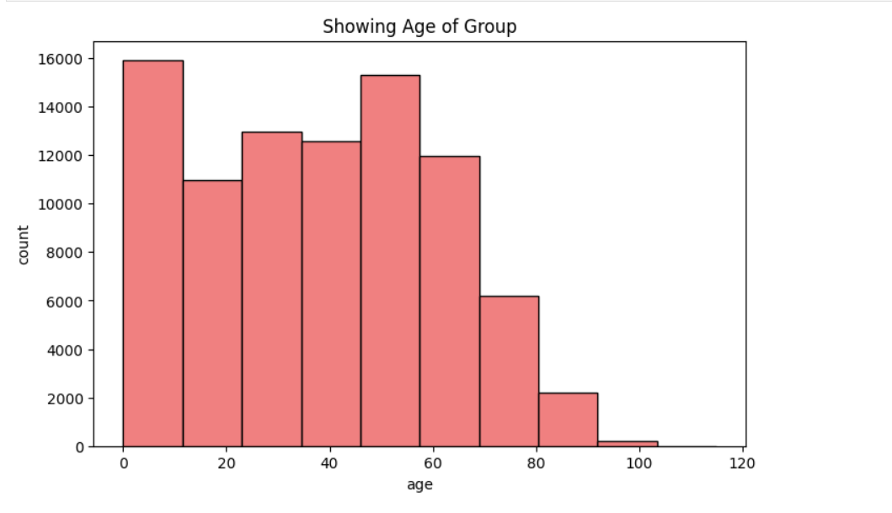
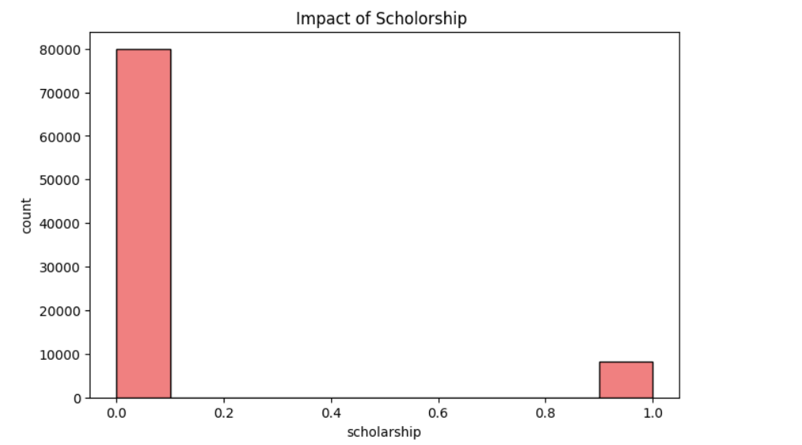
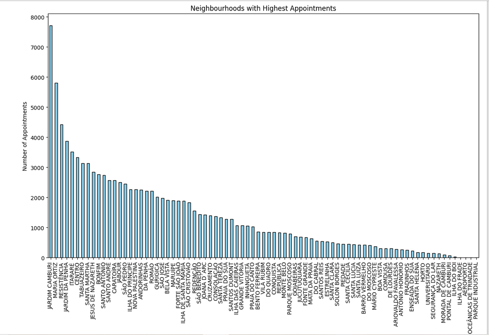
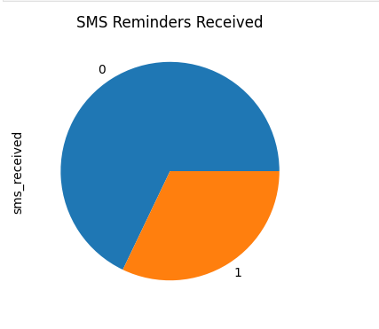
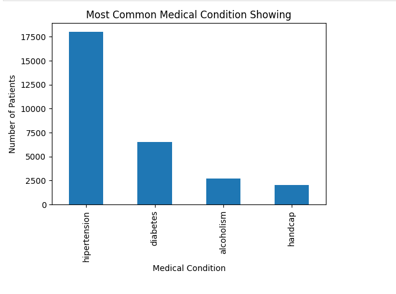
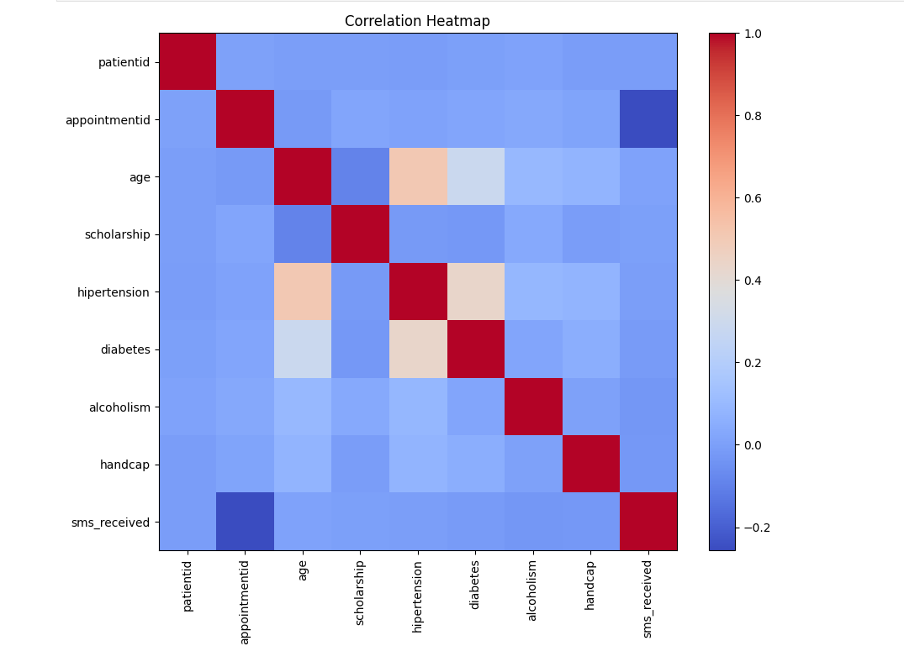

# 📋 No‑Show Appointments Analysis

An exploratory analysis of ~110,000 Brazilian medical appointments to identify factors affecting patient attendance.

---

## 📝  1. Project Introduction
No‑show appointments lead to wasted resources and delays in patient care. This analysis investigates which patient and appointment attributes correlate with missed visits, laying the groundwork for targeted interventions.

---

## 🗒️  2. Dataset Details
**Source:** [Kaggle – No‑show appointments](https://www.kaggle.com/datasets/joniarroba/noshowappointments)

---

## ❓  3. Research Questions
- **Demographics:** How do age and gender influence no-show rates?  
- **Lead time:** Does the interval between scheduling and appointment affect attendance?  
- **Communication:** What impact do SMS reminders have on reducing no-shows?  
- **Socioeconomic factors:** Are certain neighborhoods or scholarship statuses linked to higher no-shows?  
- **Comorbidities:** Which health conditions correlate with attendance patterns?

---

## 🔧  4. Data Wrangling
- Removed records with negative ages or booking dates after appointments.  
- Converted `ScheduledDay` and `AppointmentDay` to datetime formats.  
- Calculated **lead time** in days between scheduling and appointment.  
- Checked for and dropped any remaining duplicates or missing values.

  ---
  
## 🔍 5. Exploratory Data Analysis & Key Findings
- **Age distribution:** Median age ~37; higher no-show rates in patients <20 and >70.  
- **Gender:** Similar attendance patterns after adjusting for age.  
- **Lead time effect:** No-show rate increases for lead times >15 days.  
- **SMS reminders:** Patients who received reminders showed ~15% fewer no-shows.  
- **Neighborhood hotspots:** Districts such as CAMPO GRANDE and ITARARÉ exhibit >30% no-show rates.  
- **Comorbidity score:** Patients with more chronic conditions tended to attend more consistently.

---

## 📊 6. Visualizations

Visualization outputs saved in the `images/` folder, with detailed analysis below:

1. **Age Distribution Histogram**   
     
   - Shows the count of appointments by patient age bins (0–10, 11–20, …, 101–110).  
   - Most patients fall between ages 0–60, with peaks around 0–10 and 41–50.  
   - Very few appointments for ages above 90.

2. **Impact of Scholarship**  
     
   - Bar chart comparing counts of patients enrolled (1) vs. not enrolled (0) in the welfare program.  
   - Approximately 8,000 scholarship recipients vs. ~80,000 non‑recipients, indicating class imbalance.

3. **Top Neighborhoods by Appointment Volume**  
     
   - Bar plot of the top 60 districts sorted by number of appointments.  
   - JARDIM CAMBURI and MARIA ORTIZ lead with ~7,700 and ~5,800 appointments respectively.  
   - Long tail of smaller districts with fewer than 1,000 appointments.

4. **SMS Reminders Received**   
     
   - Pie chart showing proportion of patients who received (1) vs. did not receive (0) SMS reminders.  
   - Around 32% received a reminder, 68% did not.

5. **Common Medical Conditions**   
     
   - Bar chart of counts for each comorbidity: hypertension (~18,000), diabetes (~6,500), alcoholism (~2,700), handicap (~2,000).  
   - Hypertension is the most prevalent condition.

6. **Feature Correlation Heatmap**   
     
   - Displays Pearson correlations among numerical features.  
   - Age correlates moderately with hypertension (0.5) and diabetes (0.3).  
   - Negative correlation between `AppointmentID` and `SMS_received` (~–0.25) reflects dataset ordering and reminder patterns.

   *(Refer to the notebook for code and interactive plots.)*

---

## 📌 7. Conclusions & Limitations
This exploratory analysis highlights key drivers of appointment attendance, notably lead time and SMS reminders. However, limitations include:
- **Data scope:** Lacks external factors (e.g., weather, transportation).  
- **Regional bias:** Results may not generalize beyond Brazilian clinics.  
- **Static analysis:** Does not capture seasonal or temporal trends.

---

## 🚀 8. Future Work
- Integrate additional datasets (weather, traffic).  
- Analyze temporal patterns (monthly/seasonal effects).  
- Develop predictive models based on these insights.

---

## 🗂️ 10. Project Structure

├── data/           
    # raw dataset or download instructions

├── notebooks/       
    # Jupyter notebook for EDA

├── Images/         
    # visualization outputs

└── README.md        
    # project documentation

